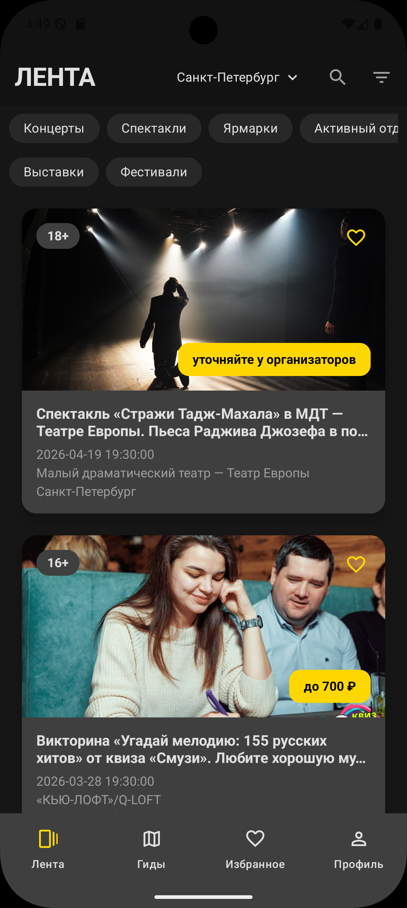
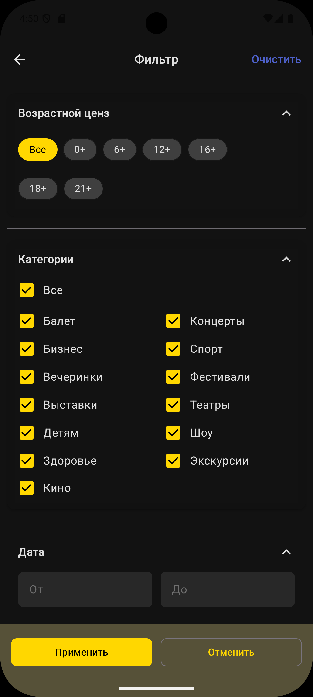
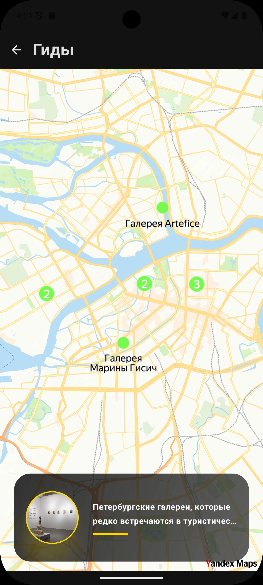
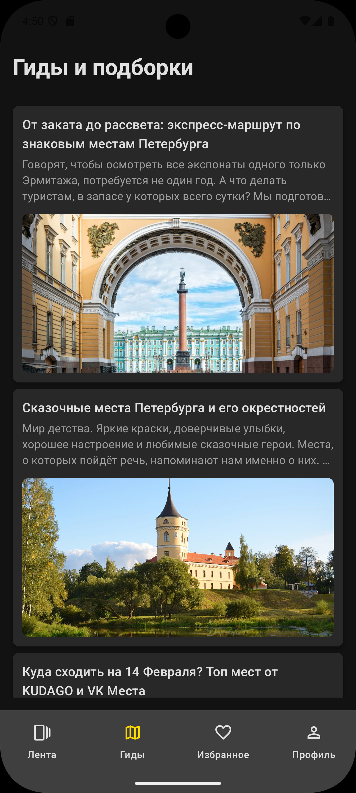
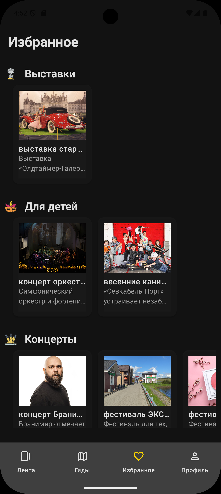

# Курсовой проект — Приложение для поиска ивентов и гидов

Данный репозиторий содержит курсовой проект, разработанный в рамках учебной программы на кампусе Альфа банка https://alfabank.ru/alfafuture/campus/androiddev/. 
Приложение представляет собой гид по туристическим местам и событиям с возможностью сохранения выбранного города и просмотра информации о достопримечательностях. 
А также просмотр туристических мест на яндекс карте

## 🚀 Основные возможности

- Выбор и сохранение текущего города 
- Отображение карты с достопримечательностями на экране гидов
- Просмотр актуальных событий и мест в выбранном городе
- Интеграция с Firebase для хранения ключей
- Чистая архитектура с разделением на слои MVVM
- Написано на Kotlin

## 🛠 Стек технологий

- **Язык:** Kotlin
- **UI:** Jetpack Compose
- **Хранение данных:** DataStore, EncryptedSharedPreferences
- **База данных/бэкенд:** Firebase, Room
- **Карты и геолокация:** [Yandex MapKit](https://yandex.ru/maps-api/docs/mapkit/index.html) — для отображения карт и мест
- **Данные о событиях и местах:** [KudaGo API](https://docs.kudago.com/api/) — получение информации о мероприятиях, местах, подборках и новостях
- **Сборка:** Gradle Kotlin DSL

## 🔧 Сборка и запуск

Просто клонируйте репозиторий

## 📌 Планы по доработке

- Добавить расширенные фильтры ивентов/мест
- Реализовать определение геопозиции и составление маршрутов
- Добавить подборки ивентов по городам

## 📱 Скриншоты

  <table>
    <tr>
      <td align="center">
        
         
        <em>Главный экран</em>
      </td>
      <td align="center">
        
         
        <em>Фильтры</em>
      </td>
      <td align="center">
        
         
        <em>Карта с ивентами</em>
      </td>
    </tr>
  </table>

  <table>
    <tr>
      <td align="center">
        
         
        <em>Экран с гидами</em>
      </td>
      <td align="center">
        
         
        <em>Экран с избранным</em>
      </td>
    </tr>
  </table>

